# WaveFinder Website

WaveFinder is a website that targets surfers. This website is for surfers who want to find the nearest surfing spots around UK. By allowing browser location feature it allows surfers to find the nearest spots for surfing. Site users can see information about our featured locations, latest photos from our latest events and our upcoming events.

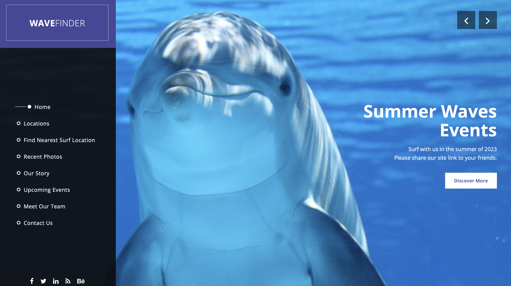

The live link for "WaveFinder website" can be found [HERE](https://sammanomar.github.io/jul-hackathon/)

## Table of Contents

- [UX](#ux "UX")
  - [Site Purpose](#site-purpose "Site Purpose")
  - [Site Goal](#site-goal "Site Goal")
  - [Audience](#audience "Audience")
  - [Communication](#communication "Communication")
  - [Current User Goals](#current-user-goals "Current User Goals")
  - [New User Goals](#new-user-goals "New User Goals")
- [User Stories](#user-stories "User Stories")
- [Design](#design "Design")
  - [Colour Scheme](#colour-scheme "Colour Scheme")
  - [Typography](#typography "Typography")
  - [Imagery](#imagery "Imagery")
- [Features](#features "Features")
  - [Existing Features](#existing-features "Existing Features")
- [Testing](#testing "Testing")
  - [Validator Testing](#validator-testing "Validator Testing")
  - [Unfixed Bugs](#unfixed-bugs "Unfixed Bugs")
- [Technologies Used](#technologies-used "Technologies Used")
  - [Main Languages Used](#main-languages-used "Main Languages Used")
  - [Frameworks, Libraries & Programs Used](#frameworks-libraries-programs-used "Frameworks, Libraries & Programs Used")
- [Credits](#credits "Credits")

## UX

### Site Purpose:

The intent of the site is to bring surfers together. [“WaveFinder”](https://sammanomar.github.io/jul-hackathon/) Is an online network platform where surfers can stay up to date with surfing events around UK.

### Site Goal:

To build a platform that allows surfers to find all what they want to know about nearby surfing events around UK.

### Audience:

For surfers. This website have no restrictions at all over user age.

### Communication:

With a clean, easy to follow layout, the site users are guided through the features of the website with an ease of navigation.

### Current User Goals:

- To allow users or surfers to identify the nearst surfing location around them in UK.
- To view the featured surfing locations around UK.
- To view the recent photos of our latest surfing events.
- To see our upcoming surfing events
- To get in touch with us using a contact form.

### Future Goals:

- Link the contact form with email API
- Allow users to Sign up and make accounts
- Develop a commercial side for the website

## User Stories

All stories have been implemented.

USER STORIES:

1. As a **site creator** I can **deploy the project** so that **I can move it to production phase**
   USER STORY: Deploy Project
2. As a **site creator** I create index page \***\* so that **I can see how my page looks like\*\*
   USER STORY: Create Index Page
3. As a **site user** I can **see a video at home page** so that **I have a better insight about the website**
   USER STORY: Presentation Video
4. As a **reviewer** I can **read a summary about the project** so that **I can better understand the website goals**
   USER STORY: Readme File
5. As a **site user** I can **allow the browser to access my location** so that **I can see the nearest surfing location**
   USER STORY: Add browser location API
6. As a **site user** I can **view the tide times at my chosen surf location** so that **I can decide if there will be enough surfing time left by the time I arrive at the destination**
   USER STORY: Tide Timing(Not Implemented)
7. As a **site user** I can **get up to date weather conditions** so that **I can decide the right day to surf**
   USER STORY: Add Weather Forecast
8. As a **site user** I can **see the information of the surfing team** so that **I can get in touch with them**
   USER STORY: Team information
9. As a **site user** I can **read about the upcoming events** so that **I can decide which event to join**
   USER STORY: Surfing theme and Content of the Website
10. As a **site user** I can **see the list of UK surfing locations to use** so that **I can pick the best location**
    USER STORY: List of UK surfing locations to use

## Design

### Wireframes:

##### Home Page:

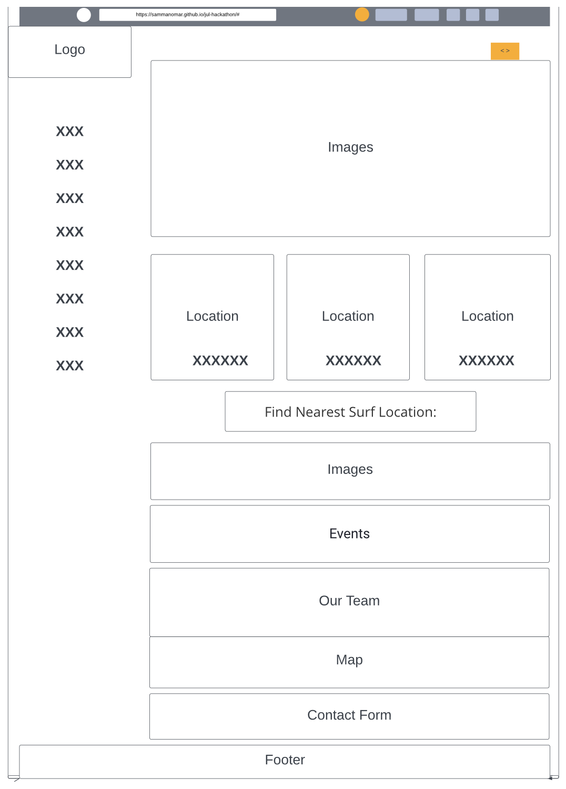

### Colour Scheme:

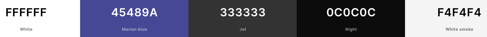

### Typography:

All fonts were obtained from fonts.googleapis (Ready to use template):

1. Open+Sans:300,400,600,700,800
2. Fontawesome
3. flexslider-icon for the slider of images at the home page

### Imagery:

- All photography for the websites were downloaded from pexel and unsplash website.

## Features

### Existing Features:

#### Featured Locations:

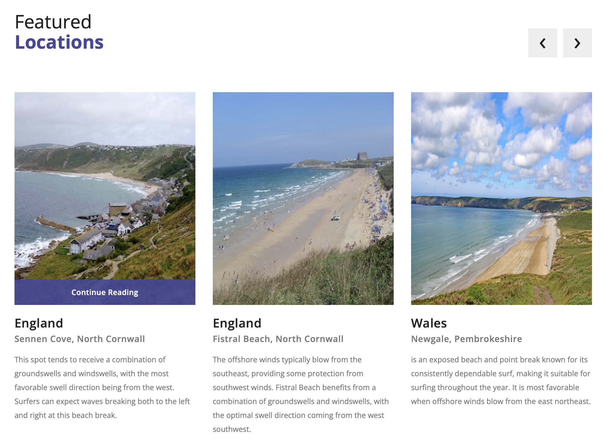

#### Find Nearest Surf Location:

#### Recent Photos:

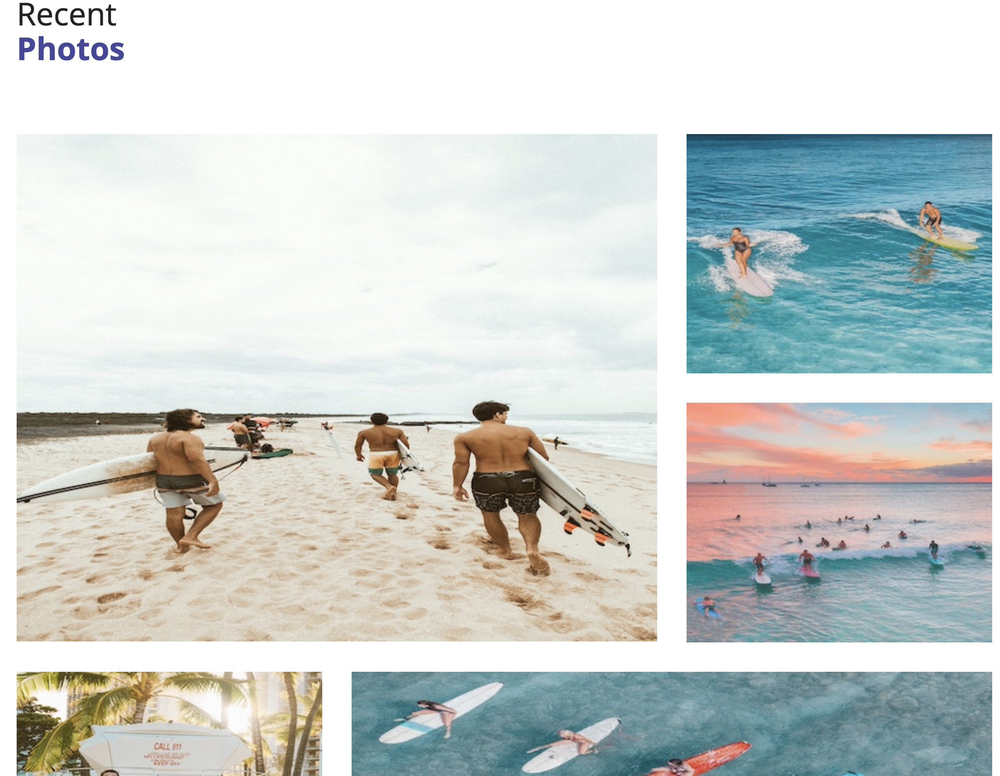

#### Our Story:

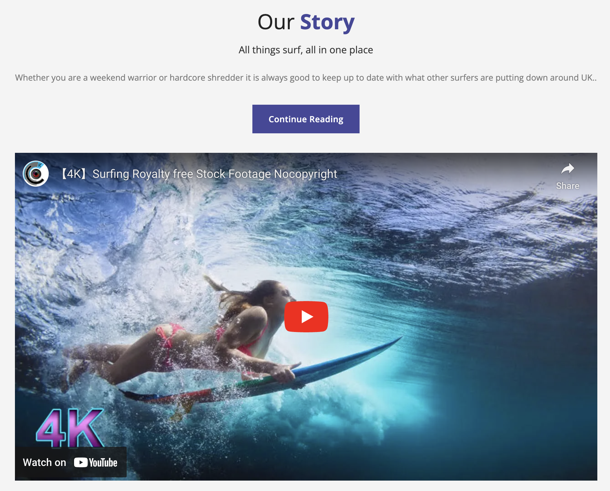

#### Our Team:

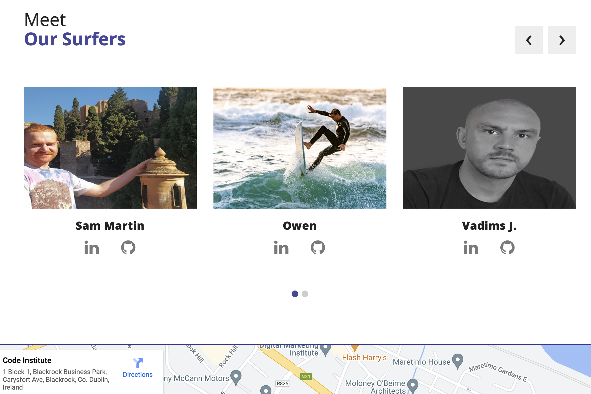

#### Contact Us:

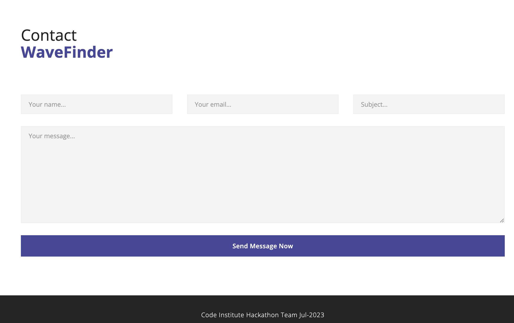

### Features Left to Implement

- Link the contact form with email API
- Allow users to Sign up and make accounts
- Develop a commercial side for the website

## Testing

### Validator Testing

- html files pass through the [W3C validator](https://validator.w3.org/) with no html issues found
  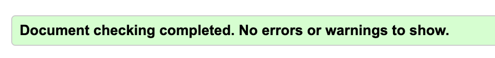

- CSS files pass through the [Jigsaw validator](https://jigsaw.w3.org/css-validator/) with no issues found.
  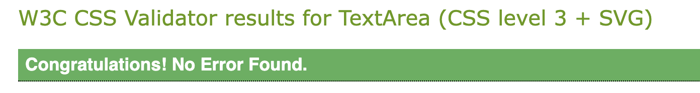

- JS files pass through [JSHint](https://jshint.com/) with no issues found.

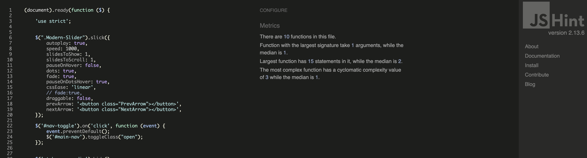

- page has an excellent Accessibility rating in Lighthouse

- Tested the site opens in Chrome & Safari without issues.
- All social links open to external pages as intended.

### Unfixed Bugs

Error at contact page with iframe at W3C HTML Validator. I couldn't fix the issue because the map is 100% responsive. I tried to add a smiliar attributes at css but it didn't respond correctly. Because these attribute are from older version of html but not html5.
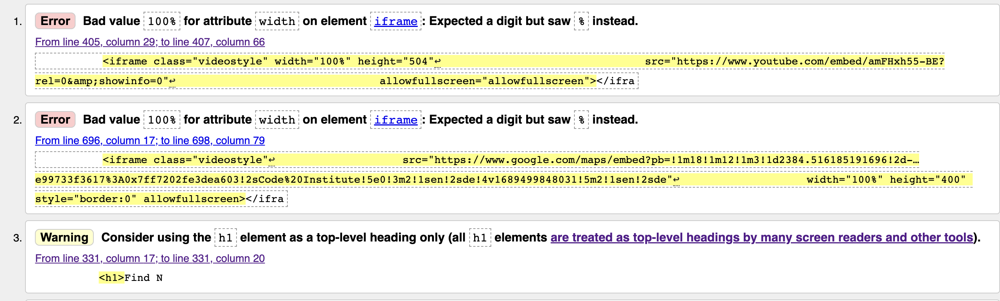

## Technologies Used

### Main Languages Used

- HTML5
- CSS3
- Javascript
- jQuery

### Frameworks, Libraries & Programs Used

- Google Fonts - for the font families:
- Font Awesome - to add icons to the social links in the footer element.
- GitPod/Codeanywhere - to create my html files & styling sheet before pushing the project to Github.
- GitHub - to store my repository for submission.
- Bootstrap
- jQuery

## Deployment

The development environment used for this project was GitPod. To track the development stage and handle version control regular commits and pushes to GitHub has been conducted. The GitPod environment was created using a template provided by Code Institute.

The live version of the project is deployed at GitHub pages.

The procedure for deployment followed the "Creating your site" steps provided in GitHub Docs.

Log into GitHub. Locate the GitHub Repository that shall be deployed live. At the top of the repository, select Settings from the menu items. Scroll down the Settings page to the ”GitHub Pages" section and click on the ”Check it out here!” At the ”Source” section choose ”main” as Branch and root as folder and click ”Save” The website will deploy and the pages refreshes to provide the live link to the project. The live link can be found here - [HERE](https://sammanomar.github.io/jul-hackathon/)

## Credits

- https://templatemo.com/: A website that was the spark of our design for this website
- https://bootstrapdocs.com/v3.3.1/docs/getting-started/
- Hackathon team on sequence based on contribution (Owen Samman/JawahirAbdul-Bari/Sam Martin, Ghassan Ishag/Vadims J., Sergios Papastergiou)
- Stackoverflow
- https://www.pexels.com/
- https://unsplash.com/
- THe video of the website: https://www.youtube.com/watch?v=amFHxh55-BE
